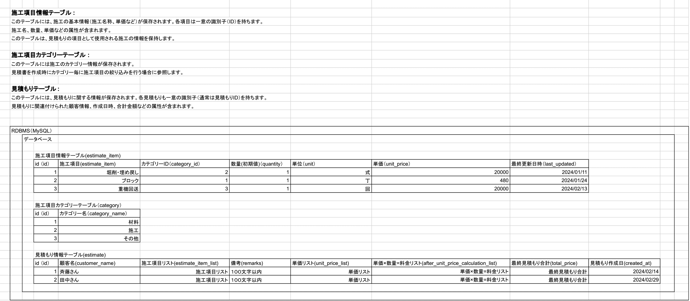
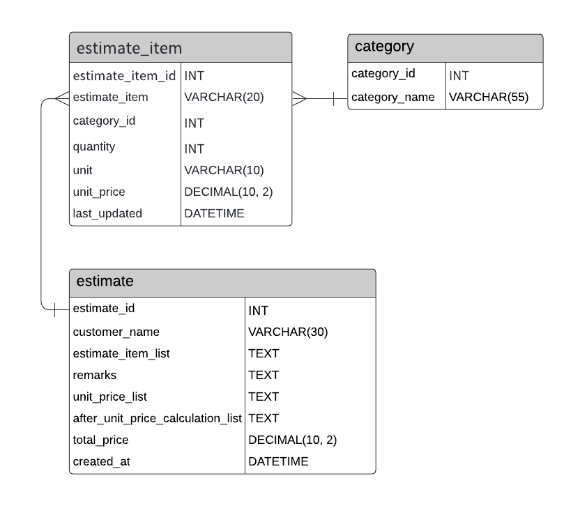

# 見積もり作成支援ツール

***

## 概要

### 見積書を作成するための見積もり情報を管理する

- 以下の情報を保持しており、それぞれ取得、登録、更新、削除の操作が可能。
    - 施工項目カテゴリー：施工カテゴリー
    - 施工項目情報：項目名称 / カテゴリーid / 数量(デフォルト) / 単位 / 単価 / 最終更新日時
    - 見積もり情報：顧客名 / 施工項目リスト / 備考 / 単価リスト / 単価×数量=料金リスト / 最終見積もり合計 / 見積もり作成日

***

## 背景

見積もり作成時に既存の項目一覧のExcel(カテゴリー混在)
から必要項目の抜き出しと単価が最新か確認しながら見積もりを作成していたため、単価情報などを常に最新情報で管理し効率改善に取り組みたいと思いました。
***

## 設計関連

**_※折りたたみを展開してください。_**

構成技術

- バックエンド: Java, Spring Boot
- フロントエンド: React, TypeScript(予定)
- その他
    - MySQL
    - Docker
    - 自動テスト
    - CI (GitHub Actions)
    - AWSデプロイ

#### Spring Boot 設定

| Project     | Gradle Project |
|-------------|----------------|
| Spring Boot | 3.2.2          |
| Language    | Java           |
| Packaging   | Jar            |
| Java        | 17             |

画面遷移

データベース定義

**_データ構造_**

**_ER図_**

※要sql定義ファイル参照

機能設計

### URL設計

| カテゴリー管理機能 | 詳細           | URL            |
|-----------|--------------|----------------|
| 全件取得      | 一覧取得         | /category      |
| 新規登録      | 新規カテゴリー登録    | /category      |
| リストの編集    | 指定したidの内容更新  | /category/{id} |
| 削除        | 指定したidのデータ削除 | /category/{id} |

| 施工項目管理機能 | 詳細               | URL                               |
|----------|------------------|-----------------------------------|
| 全件取得     | 一覧取得             | /estimate-item                    |
| 絞り込み検索   | 指定したカテゴリーidで一覧取得 | /estimate-item?category-id= ⚪︎⚪︎︎ |
| 新規登録     | 新規施工項目の登録        | /estimate-item                    |
| リストの編集   | 指定したidの内容更新      | /estimate-item/{id}               |
| 削除       | 指定したidのデータ削除     | /estimate-item/{id}               |

| 見積もり情報管理機能 | 詳細           | URL            |
|------------|--------------|----------------|
| 全件取得       | 一覧取得         | /estimate      |
| 新規登録       | 新規カテゴリー登録    | /estimate      |
| リストの編集     | 指定したidの内容更新  | /estimate/{id} |
| 削除         | 指定したidのデータ削除 | /estimate/{id} |

***

***

### メモ(削除予定)

#### データ確認簡易手順

| No | 手順内容               | コマンド	                                   | 備考                                                                                 |
|----|--------------------|-----------------------------------------|------------------------------------------------------------------------------------|
| 1  | コンテナを起動	           | docker compose up -d                    |                                                                                    |
| 2  | MySQLにログイン	        | docker compose exec db mysql -uroot -p	 | password                                                                           |
| 3  | データベース確認	          | mysql> show databases;                  |                                                                                    |
| 4  | 使うDBを指定	           | mysql> use {DB名}                        | use estimate_database;                                                             |
| 5  | テーブル確認	            | mysql> show tables;                     |                                                                                    |
| 6  | テーブルのレコードを確認	      | mysql> select * from {レコード名};           | select * from category; select * from estimate; select * from estimate_item; |
| 7  | MySQLログアウト	        | mysql> exit                             |                                                                                    |
| 8  | 起動したDockerコンテナを停止	 | docker compose down                     |                                                                                    |
| 9  | 停止できていることを確認	      | docker ps	                              |                                                                                    |

***
